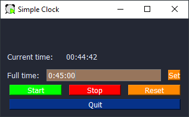

# Computer Sit Timer
![][python-versions]
![][pypi-badge]
![][gh-action-test]


This is a simple countdown timer that pops up 
and stays on top to block the view until action is taken.
It is similar to pomodoro technique,
but started from different motivation:
to not sit extensively in front of computer for better health.



Several reasons why I re-invented the wheel instead of using existing (browser) apps:
- light-weight (relatively)
- blocking/really obtrusive
- not browser extension/app (as we all spend far too long on browsers)
- runs in the notification tray (background) and not have a console/terminal there.

Also, a hobby project for myself to try out developing desktop application with Python.
Because I am lazy, I am now trying to use [`pySimpleGUI`]
(more specifically `pySimpleGUIQt` for the tray)
to do so.

## Setup and Installation
As this package is uploaded to [PyPI], the easiest way to install is via pip:
```
pip install computerSitTimer
```


## Resources:
 - [Official Cookbook for pySimpleGUI](https://pysimplegui.readthedocs.io/en/latest/cookbook/).
 - [trinket tutorials](https://pysimplegui.trinket.io/demo-programs#/demo-programs/multi-threaded-work)
   has quite something there (examples).
   It is basically like a VM and can run code and windows there.
   
<!-- Links -->
[PyPI]: https://pypi.org/project/computerSitTimer/
[`pySimpleGUI`]: https://pysimplegui.readthedocs.io/
[pypi-badge]: https://badge.fury.io/py/computerSitTimer.svg
[gh-action-test]: https://github.com/tjangoW/computerSitTimer/actions/workflows/python-test.yml/badge.svg
[python-versions]: https://shields.io/pypi/pyversions/computersittimer.svg?logo=python&logoColor=FBE072
